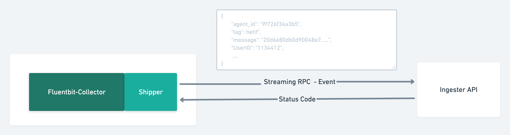

# fargo-fb-poc [WIP....!!!]

### Design and Arch
Below is the very hign level design of the project. It uses below tech stack
- GRPC - Uses GRPC to communicate between FB-Agent and  Ingester
- Kafka - Events are stored in Kafka - Persistent storage

### Fluentbit Agent
Fluentbit-Agent is used to collect events from the host system. A Fluentbit plugin is written that communicates with the Ingester API and pushes the events to it.  
- [Plugin Code](https://github.ibm.com/Gufran-Baig/fargo-fb-poc/tree/master/fluentbit-collector/plugin)

When you start the FB-Agent it will require the `ACCESS_KEY` `and ACCESS_TOKEN` 
- `ACCESS_KEY` Configuration for an agent is stored againts this access key. FB-Agent uses access key to obtain the configuration from Ingester API 
- `ACCESS_TOKEN` is the JWT authentication token. FB-Agent will include it with every request it makes to Ingester API. Ingester will validate the token. 

When FB-Agent is started it does the following
- Connect to Ingester
- Exchange the config - requires `ACCESS_TOKEN`
- Stream events to ingester - requires `ACCESS_TOKEN`

#### Config Exchange 
Below is the diagram that shows the config exchange between the FB-Agent and Ingester. Config exchange requires the valid `ACCESS_TOKEN` and `ACCESS_KEY`. It accepst the `ACCESS_KEY` as request parameter.
- You can find the whole [Config Object here](https://github.ibm.com/Gufran-Baig/fargo-fb-poc/blob/master/api/api.proto#L21)

#### Streaming Events 
It uses the Streaming RPC to stream events from the FB-Agent to the ingester API. It requires the valid `ACCESS_TOKEN` to be passed with every request.
- You can find the whole [Event Object here](https://github.ibm.com/Gufran-Baig/fargo-fb-poc/blob/master/api/api.proto#L8)

#### Features 
- AES encryption
- Server side TLS 
- Streaming RPC - Events 

#### Open Issues
- Dynamic reloading FB-Agent Config 
- Handling Auth Errors
- Handling Connectivity Error
- Handling Streaming Errors/timeouts 
