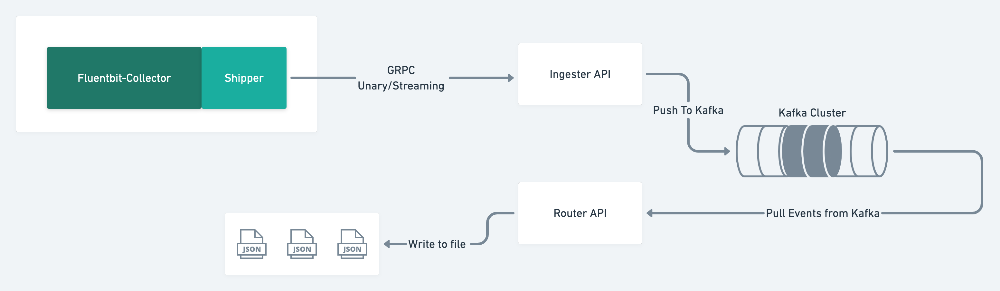

# fargo-fb-poc [WIP....!!!]

## Design and Arch
Below is the very hign level design of the project. It uses below tech stack
- GRPC - Uses GRPC to communicate between Fluentbit collector and  Ingester
- Kafka - Events are stored in Kafka - Persistent storage

